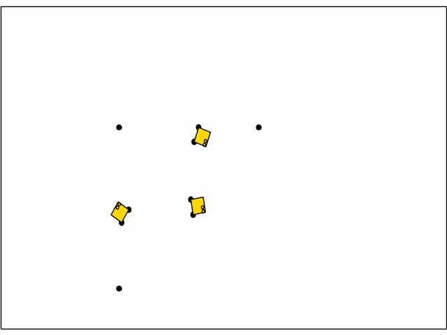

# JaxRobotarium
<p align="center">
       <a href= "https://github.com/GT-STAR-Lab/JaxRobotarium/blob/main/LICENSE">
        </a>
       <a href= "https://arxiv.org/abs/2505.06771">
        </a>
       <a href= "https://github.com/GT-STAR-Lab/JaxRobotarium">
        </a>
</p>

<p float="middle">
  
   
</p>

JaxRobotarium is an end-to-end open-source Jax-based platform designed to significantly accelerate the training and deployment of MRRL algorithms while maintaining ease-of-use and open access to hardware-based evaluations. For our code and preprint in the badge links above!

## Usage
To initialize JaxRobotarium within JaxMARL, initialize the submodule by
```
git submodule init
git submodule update
```
Then, within `jaxmarl/environments/robotarium` run
```
pip install -e .
```
For additional details, see the README.md within `jaxmarl/environments/robotarium`

## Testing
For testing integration with JaxMARL run
```
pytest tests/robotarium/test_jaxrobotarium.py 
```
and
```
pytest tests/test_envs_implement_base_api.py # note this will test all envs
```

## Citing
If you use JaxRobotarium, please cite:
1. Our work
```
@article{jain2025jaxrobotarium,
  title={JaxRobotarium: Training and Deploying Multi-Robot Policies in 10 Minutes},
  author={Jain, Shalin Anand and Liu, Jiazhen and Kailas, Siva and Ravichandar, Harish},
  journal={arXiv preprint arXiv:2505.06771},
  year={2025}
}
```
2. The Robotarium
```
@inproceedings{pickem2017robotarium,
  title={The robotarium: A remotely accessible swarm robotics research testbed},
  author={Pickem, Daniel and Glotfelter, Paul and Wang, Li and Mote, Mark and Ames, Aaron and Feron, Eric and Egerstedt, Magnus},
  booktitle={2017 IEEE International Conference on Robotics and Automation (ICRA)},
  pages={1699--1706},
  year={2017},
  organization={IEEE}
}
```