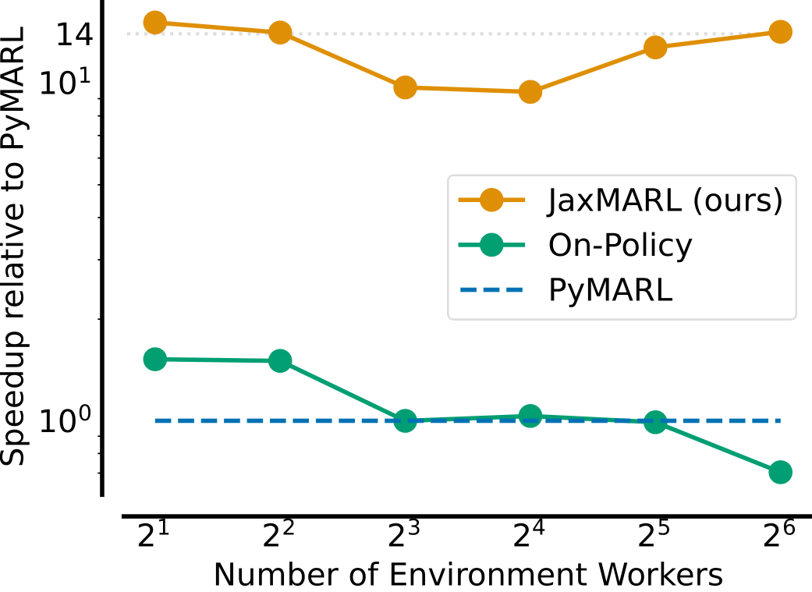

# Welcome to JaxMARL!


<div class="collage">
    <div class="column" align="centre">
        <div class="row" align="centre">
            
            
            
            
        </div>
        <div class="row" align="centre">
            
            
            
            
        </div>
    </div>
</div>

_**MARL but really really fast!**_

JaxMARL combines ease-of-use with GPU-enabled efficiency, and supports a wide range of commonly used MARL environments as well as popular baseline algorithms. Our aim is for one library that enables thorough evaluation of MARL methods across a wide range of tasks and against relevant baselines. We also introduce SMAX, a vectorised, simplified version of the popular StarCraft Multi-Agent Challenge, which removes the need to run the StarCraft II game engine. 

## What we provide:
* **9 MARL environments** fully implemented in JAX - these span cooperative, competitive, and mixed games; discrete and continuous state and action spaces; and zero-shot and CTDE settings.
* **8 MARL algorithms**, also fully implemented in JAX - these include both Q-Learning and PPO based appraoches.

## Who is JaxMARL for?
Anyone doing research on or looking to use multi-agent reinforcment learning!

## What is JAX?

[JAX](https://jax.readthedocs.io/en/latest/) is a Python library that enables programmers to use a simple numpy-like interface to easily run programs on accelerators. Recently, doing end-to-end single-agent RL on the accelerator using JAX has shown incredible benefits. To understand the reasons for such massive speed-ups in depth, we recommend reading the [PureJaxRL blog post](https://chrislu.page/blog/meta-disco/) and [repository](https://github.com/luchris429/purejaxrl).

## Basic JaxMARL API Usage 

Actions, observations, rewards and done values are passed as dictionaries keyed by agent name, allowing for differing action and observation spaces. The done dictionary contains an additional `"__all__"` key, specifying whether the episode has ended. We follow a parallel structure, with each agent passing an action at each timestep. For asynchronous games, such as Hanabi, a dummy action is passed for agents not acting at a given timestep.

```python 
import jax
from jaxmarl import make

key = jax.random.PRNGKey(0)
key, key_reset, key_act, key_step = jax.random.split(key, 4)

# Initialise environment.
env = make('MPE_simple_world_comm_v3')

# Reset the environment.
obs, state = env.reset(key_reset)

# Sample random actions.
key_act = jax.random.split(key_act, env.num_agents)
actions = {agent: env.action_space(agent).sample(key_act[i]) for i, agent in enumerate(env.agents)}

# Perform the step transition.
obs, state, reward, done, infos = env.step(key_step, state, actions)
```

## JaxMARL's performance

{ width=300px}
/// caption
Speed of JaxMARL's training pipeline compared to two popular MARL libraries when training an RNN agent using IPPO on an MPE task.
///

Our paper contains further results but the plot above illustrates the speed-ups made possible by JIT-compiling the entire traning loop. JaxMARL is 14x faster than traditional approaches for MPE, while also producing results consistent with existing implementations. For SMAC, as SMAX does not require the StarCraft II game engine to be run, we are over 31x faster.

## Related Works
This works is heavily related to and builds on many other works, PureJaxRL provides a [list of projects](https://github.com/luchris429/purejaxrl/blob/main/RESOURCES.md) within the JaxRL ecosystem. Those particularly relevant to multi-agent work are:

JAX-native algorithms:

- [Mava](https://github.com/instadeepai/Mava): JAX implementations of popular MARL algorithms.
- [PureJaxRL](https://github.com/luchris429/purejaxrl): JAX implementation of PPO, and demonstration of end-to-end JAX-based RL training.

JAX-native environments:

- [Jumanji](https://github.com/instadeepai/jumanji): A diverse set of environments ranging from simple games to NP-hard combinatorial problems.
- [Pgx](https://github.com/sotetsuk/pgx): JAX implementations of classic board games, such as Chess, Go and Shogi.
- [Brax](https://github.com/google/brax): A fully differentiable physics engine written in JAX, features continuous control tasks. We use this as the base for MABrax (as the name suggests!)
- [XLand-MiniGrid](https://github.com/corl-team/xland-minigrid): Meta-RL gridworld environments inspired by XLand and MiniGrid.

Other great JAX related works from our lab are below:

- [JaxIRL](https://github.com/FLAIROx/jaxirl?tab=readme-ov-file): JAX implementation of algorithms for inverse reinforcement learning.
- [JaxUED](https://github.com/DramaCow/jaxued?tab=readme-ov-file): JAX implementations of autocurricula baselines for RL.
- [Craftax](https://github.com/MichaelTMatthews/Craftax): (Crafter + NetHack) in JAX.
- [Kinetix](https://kinetix-env.github.io/): Large-scale training of RL agents in a vast and diverse space of simulated tasks, enabled by JAX.

Other things that could help:

- [Benchmarl](https://github.com/facebookresearch/BenchMARL): A collection of MARL benchmarks based on TorchRL.


## Citing JaxMARL
If you use JaxMARL in your work, please cite us as follows:
``` bibtex
@article{flair2023jaxmarl,
    title={JaxMARL: Multi-Agent RL Environments in JAX},
    author={Alexander Rutherford and Benjamin Ellis and Matteo Gallici and Jonathan Cook and Andrei Lupu and Gardar Ingvarsson and Timon Willi and Akbir Khan and Christian Schroeder de Witt and Alexandra Souly and Saptarashmi Bandyopadhyay and Mikayel Samvelyan and Minqi Jiang and Robert Tjarko Lange and Shimon Whiteson and Bruno Lacerda and Nick Hawes and Tim Rocktaschel and Chris Lu and Jakob Nicolaus Foerster},
    journal={arXiv preprint arXiv:2311.10090},
    year={2023}
}
```